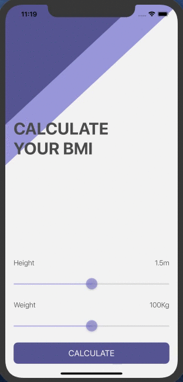

# BMI Calculator

## Goal

This project is a part of IOS Bootcamp which I am completing now on [Udemy](https://www.udemy.com/course/ios-13-app-development-bootcamp).
The goal of this project is to learn more about Swift Optionals, solidify understanding of the MVC design pattern and concept of Classes. And learn difference between Class and Struct. 

## What I made

 Made a Body Mass Index calculator. Based on the user’s weight and height it will calculate their body mass and give a piece of health advice depending on whether if they have eaten too many pies or if they need to eat more pies. 

## What I learned

* How to create multi-screen apps with animated navigation.
* Optional binding, optional chaining and the nil coalescing operator.
* How to create classes and difference between classes and structs. 
* Pass by value vs. pass by reference. 
* Formatting Strings. 
* Color literals.